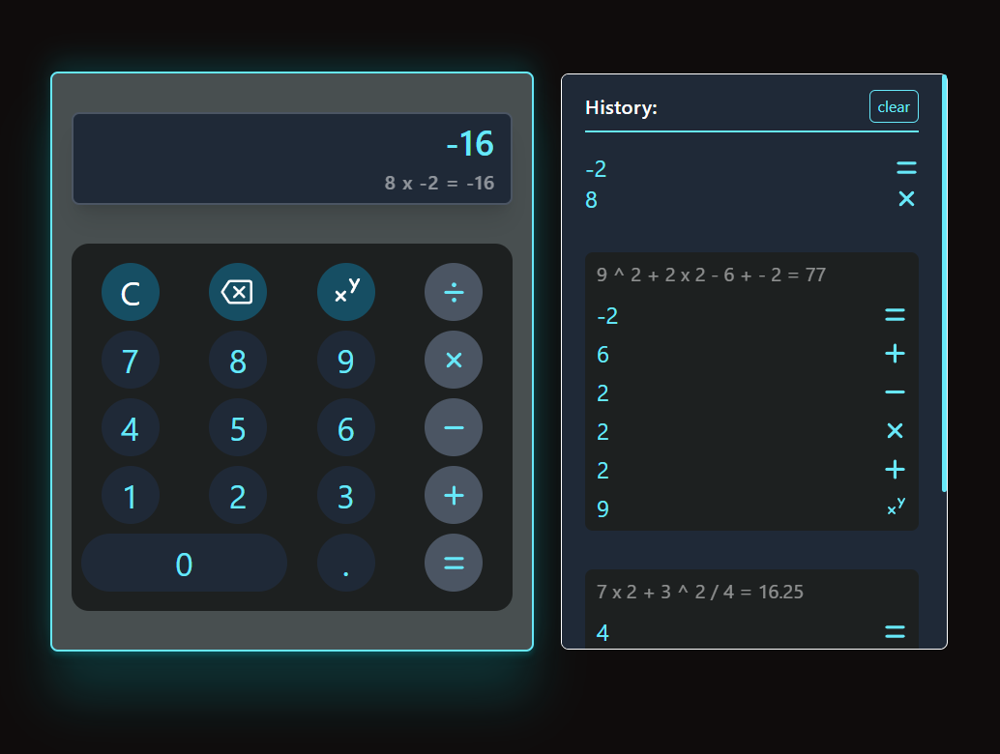

# ONP Calculator

#### Calculates the desired value using Reverse Polish Notation algorithm - supporting the proper order of operations.

#### Apart from a neat design, it displays operations chosen in current equation as well as tracks the history of your calculations.

### Examples of transformed equations

| Equation               | ONP Expression          |
| ---------------------- | ----------------------- |
| 9 x 6 + 23.0 - 8       | 9 6 \* 23.0 + 8 \_      |
| 8 - 6 + -2 x 88        | 8 6 \_ -2 88 \* +       |
| 2 ^ 5 + 3 x 6 + 7 / -1 | 2 5 ^ 3 6 \* + 7 -1 / + |
